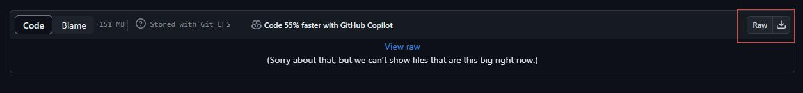

# Docker Envs for AMGC

This directory offers docker envs for AMGC.

* As we have built the runtime environment of the program with docker, there exists no problem caused by different operating environments (like different version of ubuntu).
* However, the generated executable compiled on a higher version of the CPU may not work on the lower version of the CPU. You may run into this error: "**illegal instruction**". So, we build the API in docker on the lowest version of the CPU available around us(Intel **10th** gen i5-10210U). We tested our program on "Intel **10th** gen i7-10875H" and "Intel **11th** gen i7-11700F" and found it working well.
* Building hash index has a requirement for memory size. When building the hash index of hg38.fa, 20GB is total enough (on the contrary, 8GB is not enough) in a "Intel **10th** gen i7-10875H" CPU as our experiment show.

## Docker Install
This part is referenced to: [Zhihu](https://zhuanlan.zhihu.com/p/651148141)

```terminal
sudo apt update
```
Install docker dependencies:
```terminal
sudo apt-get install ca-certificates curl gnupg lsb-release
```
Add the official Docker GPG key:
```terminal
curl -fsSL http://mirrors.aliyun.com/docker-ce/linux/ubuntu/gpg | sudo apt-key add -
```
Add a Docker repositories:
```terminal
sudo add-apt-repository "deb [arch=amd64] http://mirrors.aliyun.com/docker-ce/linux/ubuntu $(lsb_release -cs) stable"
```
Docker install:
```terminal
sudo apt-get install docker-ce docker-ce-cli containerd.io
```
Verify and check docker version:
```terminal
service docker restart
sudo docker run hello-world
sudo docker version
```


## Container Preparation

Load image:
```terminal
sudo docker load -i ./env_image_amgc.tar.gz
```
Create container:
```terminal
cd ../
sudo docker run --name amgc --shm-size 32g -it -v ./data:/data env_image_amgc /bin/bash 
```
ps: 

1. Our program needs shm to storage processed reference  gene data.(eg: ~9GB shm for hg38.fa ~3GB) 
2. '../data:/data' stands for '**source data path**: container data path' likes shared folder.
3. You may encounter this error: "unexpected EOF". This is caused as you don't download the docker image file correctly. We show three ways to download it:

* You can download the raw file directly:
* You can use our OneDrive [env_image_amgc.tar.gz](https://1drv.ms/u/s!AiyNov2MdfiQgVVf1tXkw3VmIa3w?e=e6uq9X) 
* Use **git lfs clone**

Copy api into data dir:https://1drv.ms/u/s!AiyNov2MdfiQgVVf1tXkw3VmIa3w?e=e6uq9X)

```terminal
cp /api/AMGC /data && cd /data
```

## Usage
```text
To build HASH index:
        AMGC -i <ref.fa>
To compress:
        AMGC -c -D 2 [ref.fa] -1 <input_file> 
To decompress:
        AMGC -d [ref.fa] <***.arc>

	-t INT       Thread num for multi-threading, default as [1]
	-o           Set out file name
```

## Example
``` terminal
./AMGC -i ./refdata/hg38.fa # (~12min for hg38.fa)
./AMGC -c -D 2 ./refdata/hg38.fa -1 ./testdata/SRR6691666_1_50M.fastq -t 1
./AMGC -d ./refdata/hg38.fa SRR6691666_1_50M.fastq.arc -o SRR6691666_1_50M_re -t 1
```

## Tips
``` terminal
sudo docker images -a # show already exist iamges
sudo docker ps -a # show already exist containers
sudo docker start ce2c487c79c6 #(this is your contianerID) # start a container
sudo docker exec -it ce2c487c79c6 /bin/bash # enter a container
```


## Seq Part Only

If you want to test the sequence part only, the instructions [here](../README.md) could be helpful.
